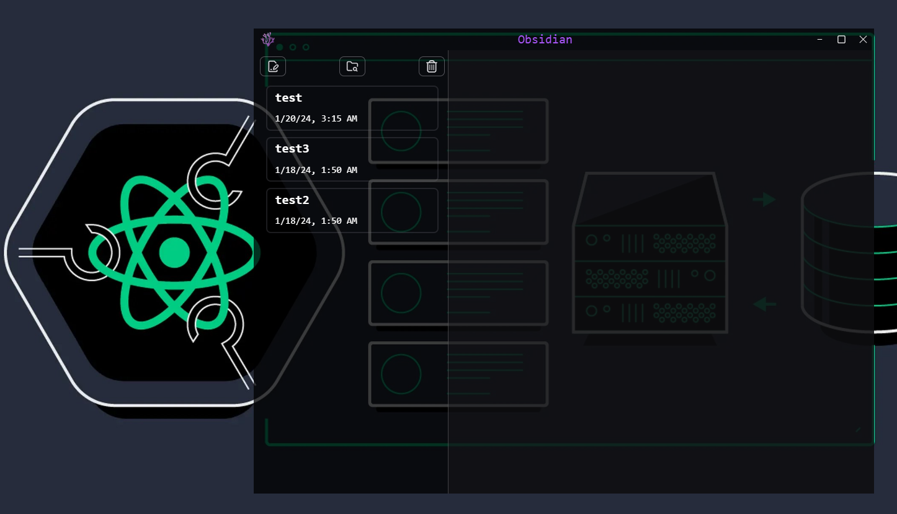

    
    <h1>Obsidian</h1>
    <h3>A Simple MarkDown Editor built with Tauri.</h3>

    

Got the idea from [this electron app tutorial](https://youtu.be/t8ane4BDyC8) & [NoteMark Repo](https://github.com/gionathas/NoteMark). I added few additional features and used `Tauri` instead of `Electron` as i already had some idea about tauri from [this project](https://github.com/Ulrich-Tonmoy/codium) i'm still working on.

# [Features lists here](./docs/v-features.md)

### Technologies

- [x] Tauri
- [x] React
- [x] TypeScript
- [x] Tailwind CSS
- [x] Jotai
- [x] MDX Editor

This template should help get you started developing with Tauri, React and Typescript in Vite.

## Recommended IDE Setup

- [VS Code](https://code.visualstudio.com/) + [Tauri](https://marketplace.visualstudio.com/items?itemName=tauri-apps.tauri-vscode) + [rust-analyzer](https://marketplace.visualstudio.com/items?itemName=rust-lang.rust-analyzer)
