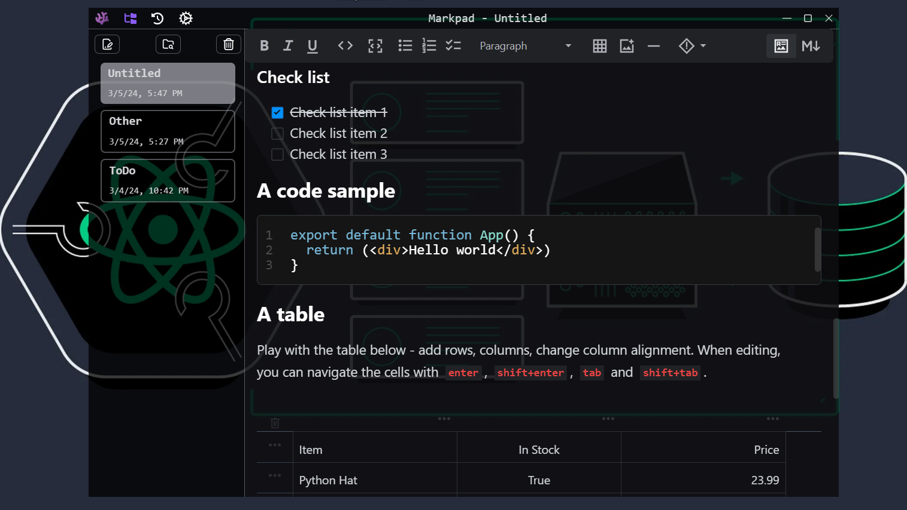

    
    <h1>Markpad</h1>
    <h3>A Simple MarkDown Notepad or Markpad built with Tauri.</h3>

> [!NOTE]  
> [Download For Windows From Here](https://github.com/Ulrich-Tonmoy/markpad/releases)

    

## [Features lists here](./docs/v-features.md)

### Technologies

- [x] Tauri
- [x] React
- [x] TypeScript
- [x] Tailwind CSS
- [x] Jotai
- [x] MDX Editor

## How to run (Windows)

> [!TIP]
> Recommended IDE Setup
>
> - [VS Code](https://code.visualstudio.com/) + [Tauri](https://marketplace.visualstudio.com/items?itemName=tauri-apps.tauri-vscode) + [rust-analyzer](https://marketplace.visualstudio.com/items?itemName=rust-lang.rust-analyzer)

> [!IMPORTANT]  
> Tools Needed
>
> - [Rust](https://www.rust-lang.org/tools/install) + [Visual Studio C++ toolchain](https://visualstudio.microsoft.com/vs/features/cplusplus/)

> [!NOTE]  
> Commands
>
> - Open the folder in `vs code` or `terminal`.
> - Run the `npm i` to install the packages.
> - Then run the `npm run tauri dev` to run the project.
